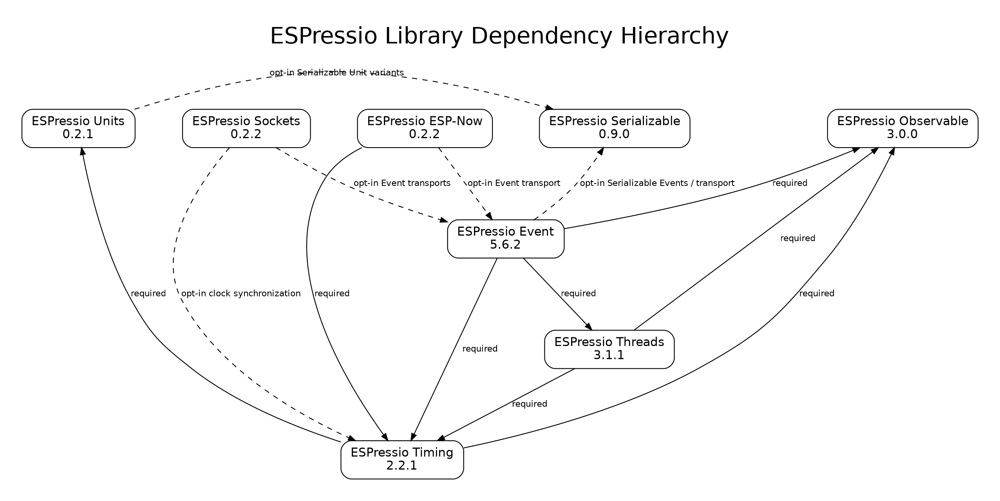

# ESPressio Dependency Chart



## Purpose

This document describes the current ESPressio dependency hierarchy relevant to
ESPressio Units 0.2.2.

- **Solid arrow** — required dependency.
- **Dashed arrow** — opt-in dependency activated only when the associated
  integration/header is selected.
- Arrows point from the dependent library to the library it consumes.

## ESPressio Units 0.2.2

**Required ESPressio dependencies: none.**

Ordinary Unit types remain standalone. Serializable variants are explicitly
opt-in:

```text
ESPressio Units 0.2.2
    - - -> ESPressio Serializable >= 0.10.1 < 1.0.0
            Serializable Unit variants only
```

## Current coordinated ecosystem

```text
FOUNDATIONAL
├── Observable 3.0.1
├── Serializable 0.10.1
├── Units 0.2.2
├── Security 0.2.0
└── Command 0.3.0

RUNTIME
└── Timing 2.2.3
    ├── Units >= 0.2.2 < 1.0.0
    └── Observable >= 3.0.1 < 4.0.0

EXECUTION
└── Threads 3.1.3
    ├── Timing >= 2.2.3 < 3.0.0
    └── Observable >= 3.0.1 < 4.0.0

TRANSPORT / INTEGRATION
├── Sockets 0.5.0
├── ESP-Now 0.5.1
└── Event 5.8.1

DIAGNOSTICS / OPERATOR
└── Serial 0.5.1
```

### Important opt-in relationships

```text
Units
  - - -> Serializable >= 0.10.1 < 1.0.0
         Serializable Unit variants

Sockets
  - - -> Event
         socket Event transports
  - - -> Timing
         clock synchronization transports
  - - -> Command / Security
         selected integrations only

ESP-Now
  -> Timing >= 2.2.3 < 3.0.0
  -> Observable >= 3.0.1 < 4.0.0
  - - -> Event
         ESP-NOW Event transport
  - - -> Command / Security
         selected integrations only

Event
  -> Threads >= 3.1.3 < 4.0.0
  -> Timing >= 2.2.3 < 3.0.0
  -> Observable >= 3.0.1 < 4.0.0
  - - -> Serializable >= 0.10.1 < 1.0.0
         Serializable Events / Event Transport
  - - -> Security / Command / Sockets
         Observer-to-Event bridges
  - - -> ESP-Now
         legacy ESPNowTransportEventBridge location; see cycle note below

Serial
  - - -> Command / Security / Sockets / ESP-Now
  - - -> Event / Serializable / Timing / Threads
         selected console/monitor integrations only
```

## Circular-dependency rule

The intended ESPressio rule is that integration dependencies cascade only
**downstream**. A higher-level library may consume an abstraction from an
upstream library, but an upstream library should not acquire a reverse
dependency merely to host an integration.

There is one currently known reciprocal optional relationship:

```text
ESP-Now - - -> Event
    ESPNowEventTransport

Event - - -> ESP-Now
    ESPNowTransportEventBridge
```

Although both edges are opt-in, together they form an architectural cycle. The
preferred resolution is to keep Event transport-neutral and move the
ESP-Now-specific Observer-to-Event bridge downstream into ESP-Now's Event
integration (or a dedicated downstream integration package). No new reciprocal
dependency should be introduced while that relocation remains outstanding.

## Architectural principle

> Foundational libraries expose the synchronous, typed, or transport-neutral
> abstraction they own. Integration code belongs downstream with the component
> that introduces the additional dependency.

For Units specifically, this means Serializable remains optional and one-way:

```text
Serializable
      ^
      |
      | optional
      |
Units Serializable variants
```

Serializable does not depend on Units.
