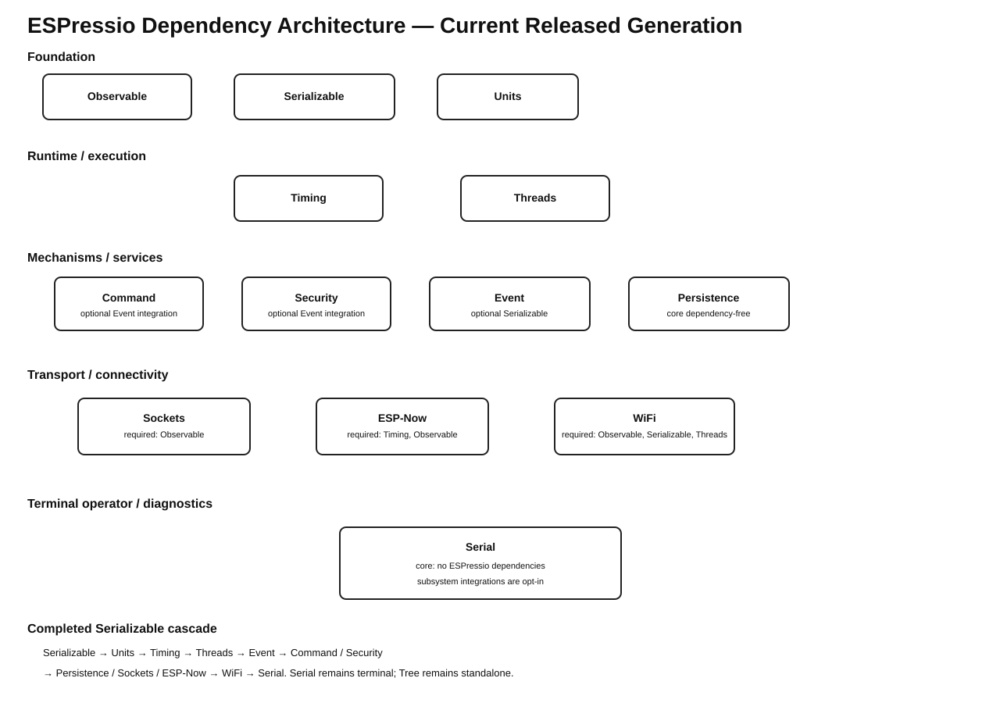

# ESPressio Dependency Chart



## Purpose

This document describes the released ESPressio dependency hierarchy relevant to ESPressio Units 0.2.3 after completion of the Event 6.0.0 architecture cleanup and downstream release cascade.

- **Solid arrow** — required dependency.
- **Dashed arrow** — opt-in dependency activated only when the associated integration/header is selected.
- Arrows point from the dependent library to the library it consumes.

## ESPressio Units 0.2.3

**Required ESPressio dependencies: none.**

Ordinary Unit types remain standalone. Serializable variants are explicitly opt-in:

```text
ESPressio Units 0.2.3
    - - -> ESPressio Serializable >= 0.10.2 < 1.0.0
            Serializable Unit variants only
```

## Current coordinated ecosystem

```text
FOUNDATIONAL
├── Observable 3.0.1
├── Serializable 0.10.2
├── Units 0.2.3
├── Security 0.3.0
└── Command 0.4.0

RUNTIME
└── Timing 2.2.4
    ├── Units >= 0.2.3 < 1.0.0
    └── Observable >= 3.0.1 < 4.0.0

EXECUTION
└── Threads 3.1.4
    ├── Timing >= 2.2.4 < 3.0.0
    └── Observable >= 3.0.1 < 4.0.0

EVENT
└── Event 6.0.0
    ├── Threads >= 3.1.4 < 4.0.0
    ├── Timing >= 2.2.4 < 3.0.0
    ├── Observable >= 3.0.1 < 4.0.0
    └── Serializable >= 0.10.2 < 1.0.0 [optional]

TRANSPORT / INTEGRATION
├── Sockets 0.6.0
└── ESP-Now 0.6.0

DIAGNOSTICS / OPERATOR
└── Serial 0.6.0
```

### Important opt-in relationships

```text
Units
  - - -> Serializable >= 0.10.2 < 1.0.0
         Serializable Unit variants

Command 0.4.0
  -> Observable >= 3.0.1 < 4.0.0
  - - -> Event >= 6.0.0 < 7.0.0
         Command-owned Event types / CommandRegistryEventBridge

Security 0.3.0
  -> Observable >= 3.0.1 < 4.0.0
  - - -> Event >= 6.0.0 < 7.0.0
         Security-owned Event types / TransportSecurityEventBridge

Sockets 0.6.0
  - - -> Event >= 6.0.0 < 7.0.0
         socket Event transports and Sockets-owned Event bridges
  - - -> Timing / Command / Security
         selected integrations only

ESP-Now 0.6.0
  -> Timing >= 2.2.4 < 3.0.0
  -> Observable >= 3.0.1 < 4.0.0
  - - -> Event >= 6.0.0 < 7.0.0
         ESPNowEventTransport and ESP-Now-owned Event types/bridge
  - - -> Command / Security
         selected integrations only

Event 6.0.0
  -> Threads >= 3.1.4 < 4.0.0
  -> Timing >= 2.2.4 < 3.0.0
  -> Observable >= 3.0.1 < 4.0.0
  - - -> Serializable >= 0.10.2 < 1.0.0
         Serializable Events / Event Transport

Serial 0.6.0
  - - -> Command / Security / Sockets / ESP-Now
  - - -> Event / Serializable / Timing / Threads
         selected console/monitor integrations only
```

## Circular-dependency rule

Integration dependencies must cascade only downstream. Event 6.0.0 removed its reverse dependencies on ESP-Now, Sockets, Command, and Security; those domain libraries now own their respective concrete Event types and Observer-to-Event bridges.

The completed architecture therefore contains no reciprocal Event/domain dependency pair:

```text
Command  - - -> Event
Security - - -> Event
Sockets  - - -> Event
ESP-Now  - - -> Event

Event -> Command   NONE
Event -> Security  NONE
Event -> Sockets   NONE
Event -> ESP-Now   NONE
```

Timing and Threads bridges remain in Event because Event already legitimately consumes Timing and Threads for its own mechanism; moving those bridges upstream would create reverse dependencies.

## Architectural principle

> Foundational libraries expose the synchronous, typed, or transport-neutral abstraction they own. Integration code belongs at the lowest-order consumer that can own it without introducing a reverse dependency.

For Units specifically, Serializable remains optional and one-way. Serializable does not depend on Units.
