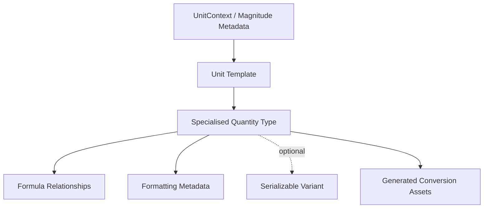

# Extension Architecture

Extending ESPressio Units means extending the compile-time physical model, not adding runtime plug-ins.

## Extension invariants

New unit support must preserve:

- compile-time distinction between incompatible quantities;
- explicit canonical magnitude;
- checked conversion semantics;
- stable symbol/name metadata;
- dimensional correctness in formulas;
- no mandatory Serializable dependency for ordinary Unit types.

## What not to do

Do not represent a new physical quantity merely as an alias of an unrelated existing context because they happen to share the same underlying SI unit. Physical context expresses API meaning as well as dimension.

Do not add runtime polymorphism where the existing compile-time model can express the relationship.