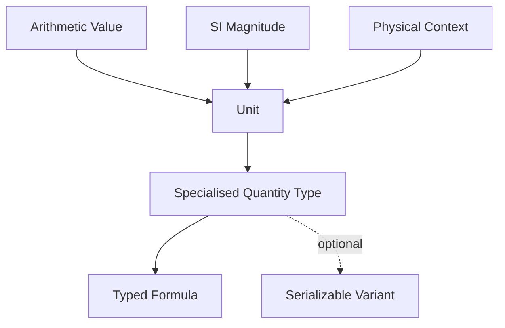

# ESPressio Units

> Documentation baseline: **1.0.0**

ESPressio Units provides strongly typed SI units and physical quantities for the ESPressio Development Platform.

Physical meaning becomes part of the C++ type system, allowing APIs to distinguish seconds from milliseconds, distance from energy, and other otherwise-identical numeric values at compile time.

## Choose your documentation path

### Using the library

- [Getting Started](Getting-Started)
- [Unit Contexts](Unit-Contexts)
- [Orders of Magnitude](Orders-of-Magnitude)
- [Specialised Quantity Types](Specialised-Quantity-Types)
- [Time Types](Time-Types)
- [Conversion](Conversion)
- [Strongly Typed Formulas](Strongly-Typed-Formulas)
- [Formatting](Formatting)
- [Serializable Units](Serializable-Units)
- [Performance Considerations](Performance-Considerations)

### Extending the library

- [Extension Architecture](Extension-Architecture)
- [Adding a Unit Context](Adding-a-Unit-Context)
- [Adding Specialised Quantity Types](Adding-Specialised-Quantity-Types)
- [Adding Formula Relationships](Adding-Formula-Relationships)
- [Adding Serializable Variants](Adding-Serializable-Variants)
- [Generated Conversion Assets](Generated-Conversion-Assets)
- [Testing Unit Extensions](Testing-Unit-Extensions)

## Core design

Ordinary Unit types have no mandatory ESPressio dependency. Serialization remains an explicitly selected optional layer.