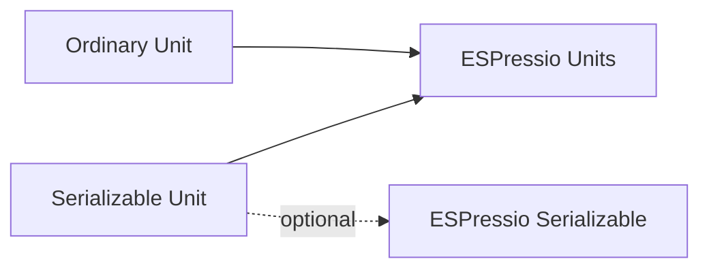

# Serializable Units

Serialization is deliberately optional. Ordinary Unit types do not require ESPressio Serializable.

Applications that need serializable quantity values explicitly select the corresponding Serializable variants, including through:

```cpp
#include <ESPressio_SerializableUnits.hpp>
```

## Dependency boundary



This keeps libraries such as Timing free to use strong time types without inheriting a serialization dependency unless serialized representation is actually required.

## Value semantics

Serializable Unit variants are intended to remain usable as ordinary values, including as aggregate members and standard-container elements.

## Extension path

When adding a new Unit context/type, add a Serializable counterpart only when the base type is complete and its serialized schema/field semantics are clear. See [Adding Serializable Variants](Adding-Serializable-Variants).